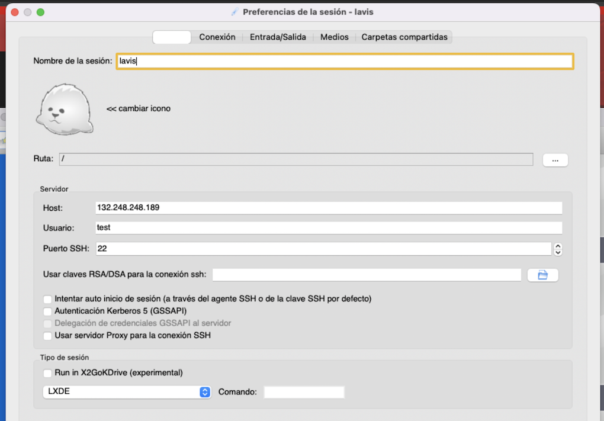

Maquina Virtual en LAVIS
========================

Maquina Virtual en Laboratorio Nacional de Visualización Científica Avanzada. Esta maquina virtual 
servira como un ambiente de trabajo temporal para manejar y analizar imagenes de resonancia 
magnetica, estructurl y funcional.

Esta maquina cuenta con los software's: FSL, freesurfer, R, ...

Para trabajar con esta maquina virtual se tienen dos opciones, en modo terminal (ssh) y en modo 
interface grafico (x2goclient).

El usuario y password que se tiwnw en esta maquinas es respectivamente: test , PruebaVM2025

La direccion IP es: 132.248.248.189

Para trabajar en  x2goclient, hay que bajar de Internet el programa y despues configurar una secion, 
como se muestra en la figura siguiente:

